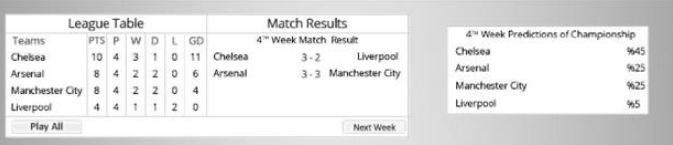
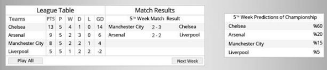

# Champions League
In this project, we expect you to complete a simulation. In this simulation, there will be a group of
football teams and the simulation will show match results and the league table. Your task is to estimate
the final league table.

## League Rules:
- There will be four teams in the league (if you wish, you can choose teams that have different strengths
and you can determine the results of the matches depending on the strengths of these selected teams).
- Other rules in the league (scoring, points, goal difference, etc.) will be the same as the rules of the
Premier League.

[https://www.premierleague.com/tables](https://www.premierleague.com/tables)

Figure 1.a 4th Week (Before the button is clicked)

Figure 2.a 5th Week (After the button is clicked)

As can be seen in Figure 1.a and Figure 2.a, each screen of the subsequent week will represent the
league table and updated the match status. Moving forward, both the point scores and the results of the
matches will be represented by this screen. In addition, after the 4th week, your estimation will also be
represented on this screen.

#Instructions
- Run: `composer install` to download all packages.
- Edit config (DB,..etc) in `.env` file.
- Run `php artisan migrate` to create database tables.
- Run `php artisan db:seed` to add four teams in teams tables.
- Visit home page (`/`), and create a season, then everything will be clear.

# For any Question
Mail me at [ben.fathi.ali.84@gmail.com](mailto:ben.fathi.ali.84@gmail.com)

